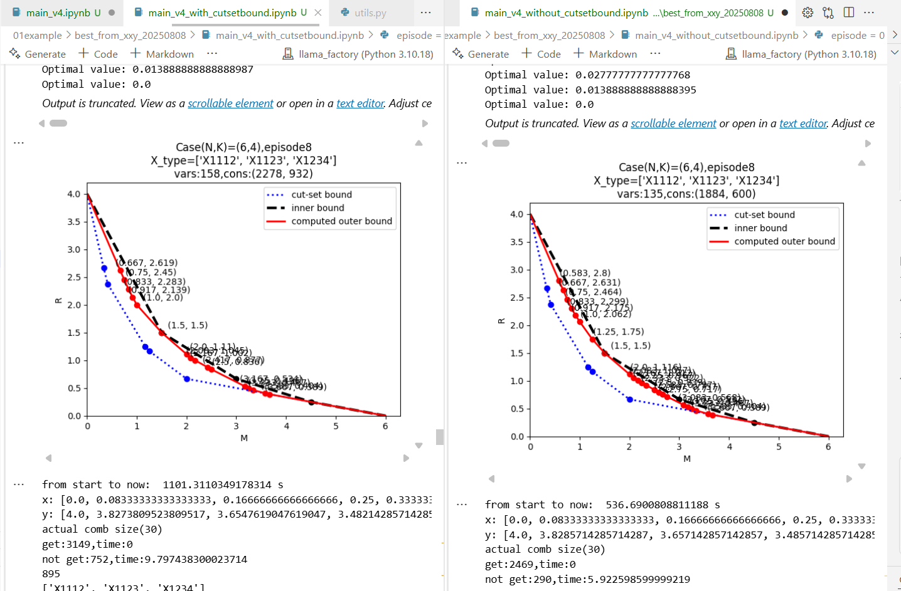
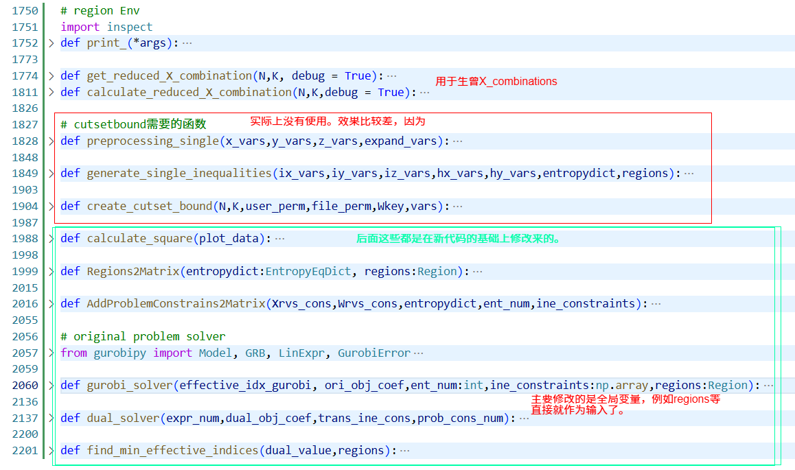

# cutset bound直观对比

- 反正是感觉不加cutsetbound会好很多。
- 所以决定不使用cutsetbound

# 自己微改

- 测试结果：
  - 都存在比较好的效果（接近完全收敛）
  - 都有比较差的效果（也就是比较靠外，而且收敛比较慢）
  - 都存在status = 4的问题
- 综上，认为代码基本一致开始修改为converseenv。
- 总结主要修改部分：
  - 
  - 大致就像上面那样。自我感觉没有修改原来的代码结构，现在可以进行converseenv的创建了。
