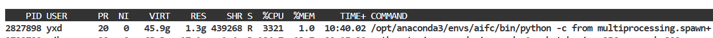
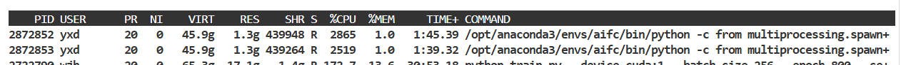
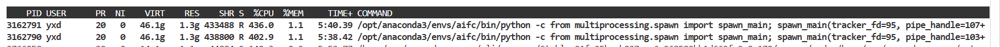
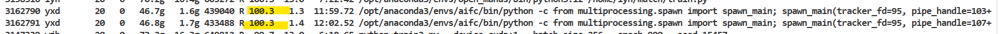
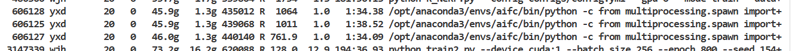
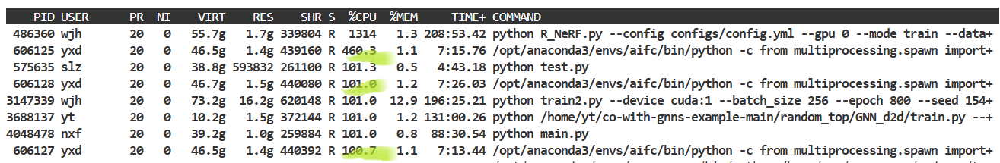
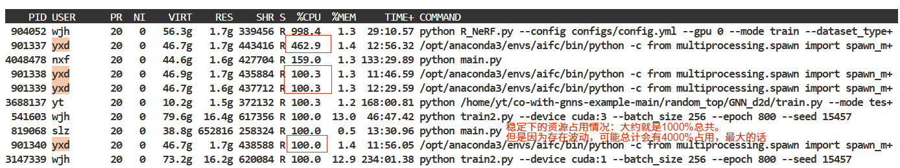

> 注意这里的路径是\斜杠。如果在其他的设备下可能存在问题。

# worker number
这里主要展示了使用各个worker下的效果：

## worker = 2

average_time:
```python
>>> clocktime_2 = [        1082.3964502811432,
...         1118.812343120575,
...         1128.3157515525818,
...         1100.960628271103,
...         1210.9836995601654,
...         1152.417447090149,
...         1119.338466644287
...     ]
>>> import numpy as np
>>> np.mean(clocktime_2)
1130.460683788572
```
cpu占用情况：
- 小NK下的占用情况：


- 大NK（实际使用中）cpu占用最高在400-500附近，一般在100左右徘徊。


- 大NK下实际实际会出现比较大的CPU占用的情况，但是时间很短，而且多为单个比较大，另一个比较小。最大会超过2k达到大约2700%左右。

## worker = 3
时间：
```python
>>> np.mean([        842.0853092670441,
...         815.4555377960205,
...         875.1948351860046
...     ])
844.2452274163564
>>> 844.2452274163564
```
cpu占用：
- 与前面的效果差不多，大约是500~600%和100%徘徊的样子。偶见比较大的1000~2000%的峰值，但是都是但都是单个出现的样子（略去图片）。

    - 一开始，对应小NK

    - 之后，对应大的NK，也就是说大NK下倾向于占用更小的CPU资源。


## worker = 4
cpu占用：
- 稳定

## 总结
```python
>>> # 两个worker，对应需要计算7//2=4次
>>> np.mean(clocktime_2)
1130.460683788572
>>> np.mean(clocktime_2)/4
282.615170947143
>>> # 三个worker，对应需要计算7//3 = 3次
>>> np.mean([842.0853092670441, 815.4555377960205, 875.1948351860046])
844.2452274163564
>>> np.mean([842.0853092670441, 815.4555377960205, 875.1948351860046])/3
281.41507580545215
>>> # 四个worker，对应需要计算7//4 = 2次
>>> np.mean([661.916111946106, 676.0401608943939])
668.9781364202499
>>> np.mean([661.916111946106, 676.0401608943939])/2
334.48906821012497
>>> # 综上，使用4个worker时，因为资源限制已经不能全速跑了。这里的话，看起来还可以，所以就选择woker_num=4了。
```

# GPU 求解
- 个人认为可以不使用GPU进行求解哎。

1. 使用GPU求解的一阶算法不一定可以实现比较好的效果（之前似乎进行过测试）：

- 直接援引自[gurobi官方](https://www.gurobi.com/resources/using-gpus-to-solve-lps-whats-in-it-for-me/)：
    > Our preliminary and internal benchmarks show only 72 out of 2633 models where PDHG is better than our default settings (only 17 of those show more than a factor of 2 improvement).
    > 我们的初步内部基准测试显示，在2633个模型中，只有72个模型的PDHG优于我们的默认设置（其中只有17个模型显示出超过2倍的改进）。

2. 现在的CPU占用已经达到了可接受的地步。

