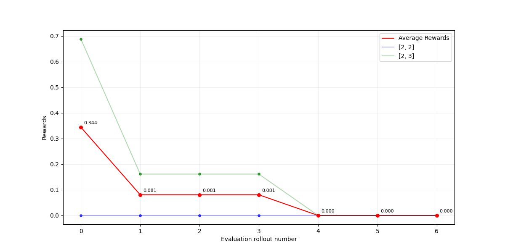
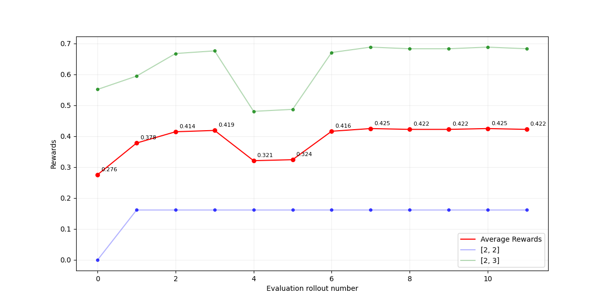
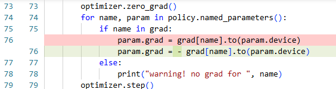
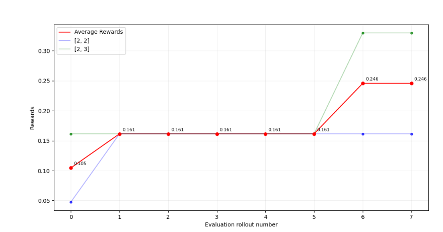
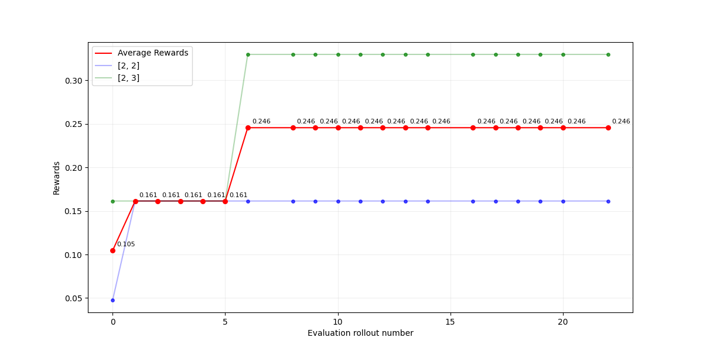
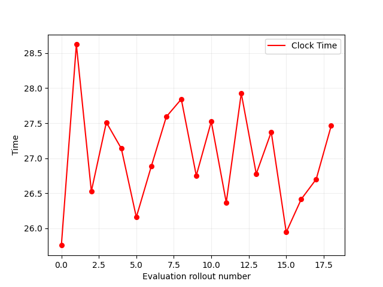
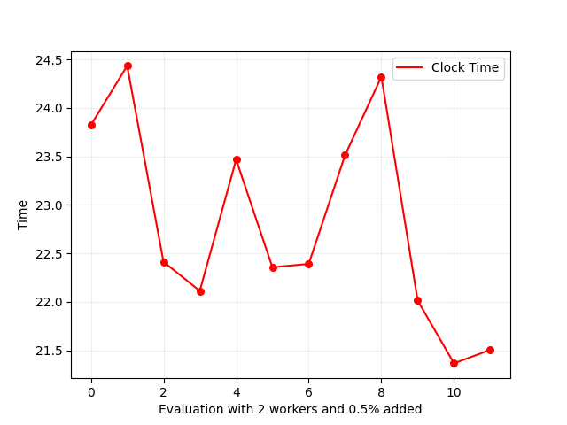
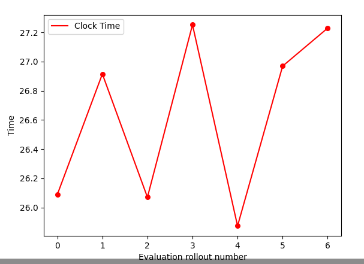
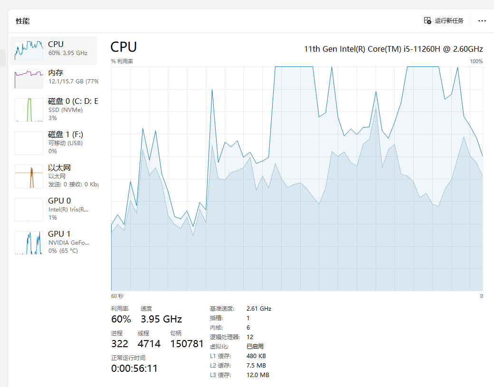
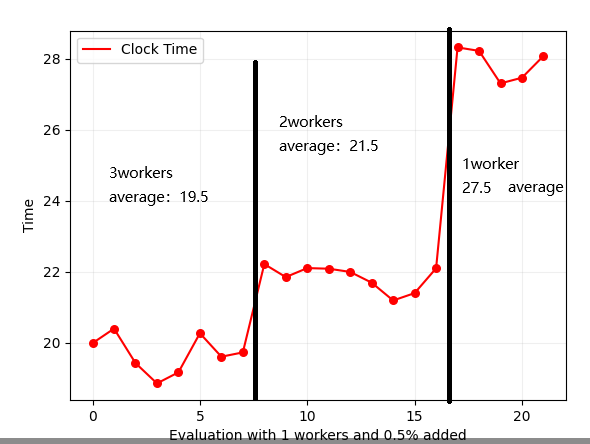

# 重构目标

- [X] 将learntoconverse-master重构为现在的train.py代码。写入最外面的train.py文件，此外，需要将其他的写入utils.py。
- [X] 使用python3。
- [ ] 使用pytorch实现训练，以使用GPU。`其实只有部分使用GPU，具体而言，是在参数更新的时候，使用的optimizer和GPU进行的参数更新`
- [X] 彻底去除网络通信，直接连接原始的converseenv.py。`还存在一些问题，关于这里的converseenv`
- [X] **添加并行处理**以~~实现快速训练~~（目标提速4倍以上，worker=4），也就是6个epsilon，2个evaluate；或者4个epsilon，3个evaluate `添加了并行处理，但是没有实现快速训练`
- [X] 添加config统一进行管理相关参数，去除args操作，手动在config中修改相关参数。原始的参数由原来的代码直接得到。

# 实现效果

## 1. 基础效果：选择能力提升

- 存在不理解的地方，为什么需要反向设置梯度。
- 总之，使用反向梯度可以比较好的实现训练。比较稳定。

| 方法       | 正向梯度                                                                                | 反向梯度                                                                                                                                                           |
| ---------- | --------------------------------------------------------------------------------------- | ------------------------------------------------------------------------------------------------------------------------------------------------------------------ |
| 奖励图展示 |  是的，反向优化大师就是这样的。确实奖励越来越小了。 |                                                                                                                                     |
| 代码修改   |                                                                                         |  注意到这里是将计算出来的梯度的负值传递给了policy的各项param中的grad参数。 然后使用optimizer进行参数更新的 |

## 2. 继续训练

- 原始的训练效果：

- 停止训练之后，继续训练：

## 3. 基于pretrained_model进行训练

略

## 4. 并行处理效果展示

- 总结：有一定的效果，但是没有达到我们预计的反比于worker_num的效果，可能和cpu已经达到了100%有关。
- **需要在服务器上进一步测试**
  - **指定种子**
  - **注意观察cpu占用情况，从小worker到大worker。**

| worker number             | 1                                    | 2                             | 3                                                                                                          |
| ------------------------- | ------------------------------------ | ----------------------------- | ---------------------------------------------------------------------------------------------------------- |
| rollout时间图             |  |  |                                                              |
| 大约平均时间s/rollout[^1] | 27                                   | 23                            | 19.5                                                                                                       |
| cpu占用情况               | 80%                                  | 100%                          | 100%此时占用：  日常占用：  |

更直观：

[^1]: 这里的轮次是相同的，所以可以比较效果。
